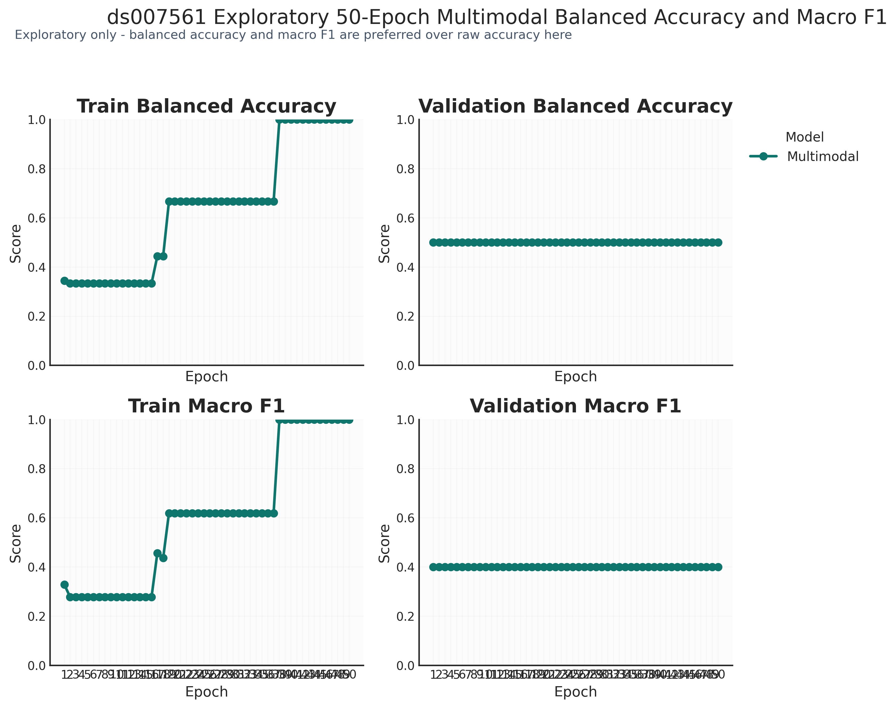
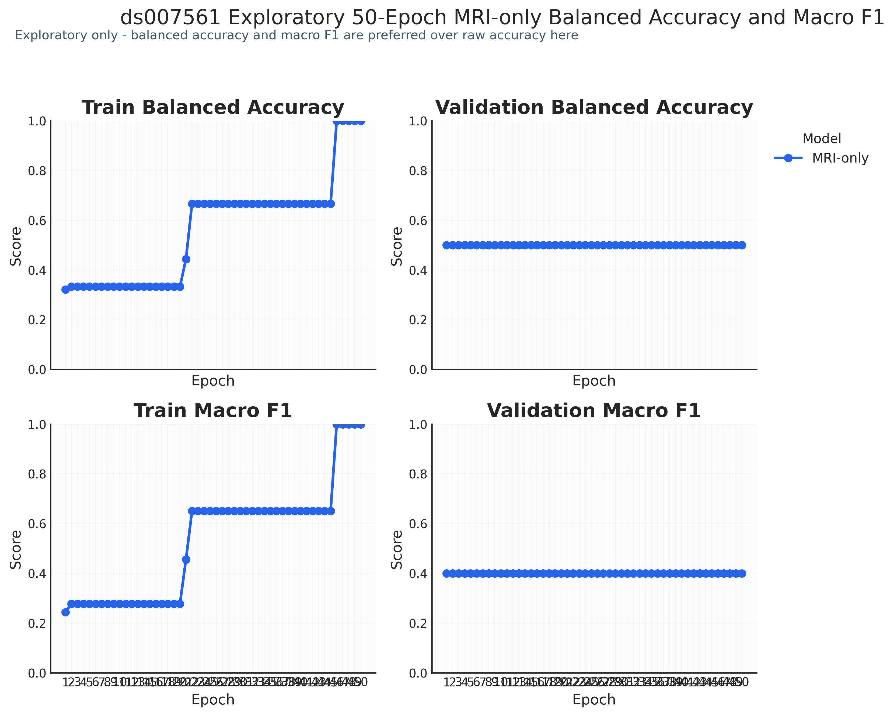
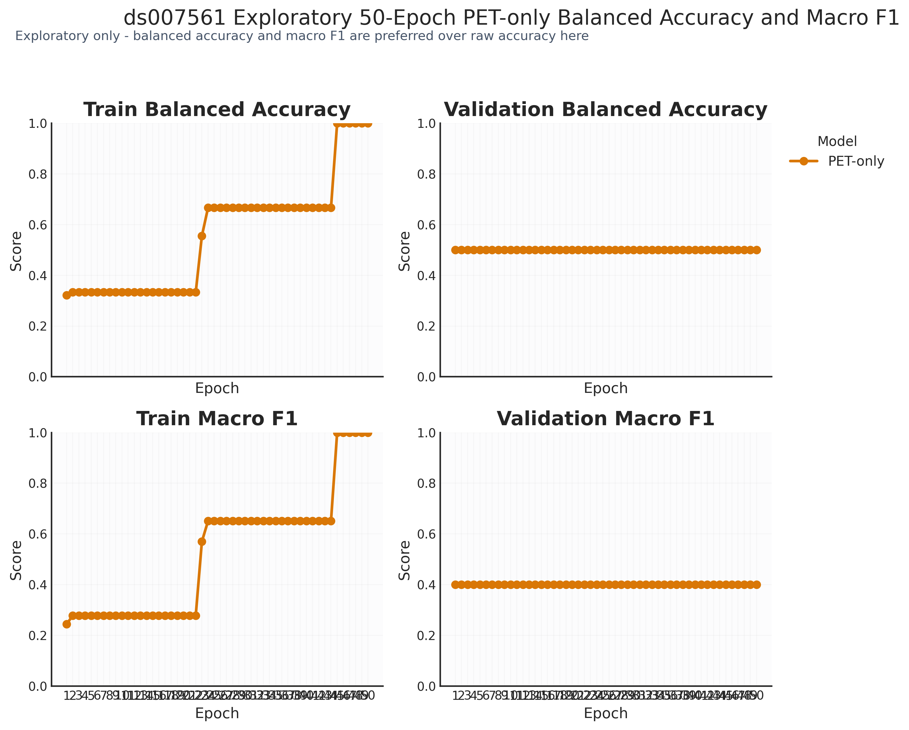
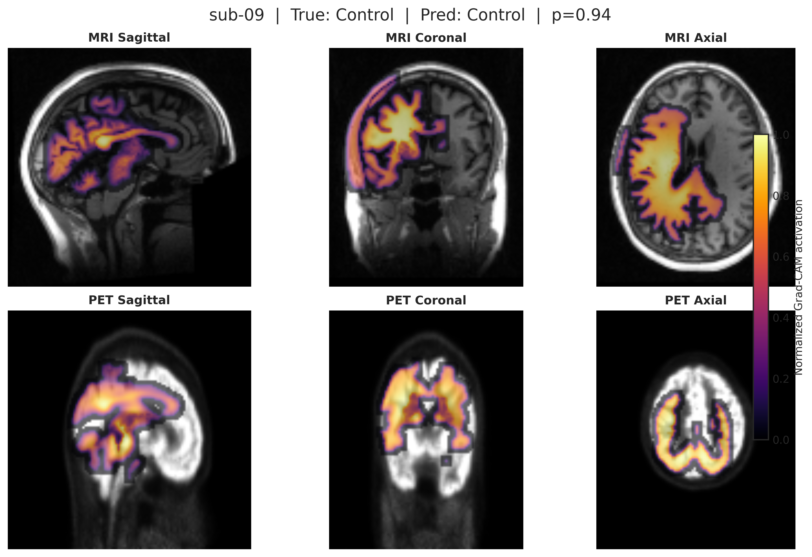

# ds007561 Final 50-Epoch Comparison

This final report closes the current `ds007561` study. All results remain exploratory. The cohort is extremely small and imbalanced (`20` paired subjects total; `Control=14`, `MCI=5`, `AD=1`), and under the fixed `seed=42` split the single `AD` subject remains in training only.

## Final Outcome

Across `50` epochs, all three models reached perfect training performance but failed to improve held-out performance:

- Multimodal reached `train_balanced_accuracy=1.0000` and `train_macro_f1=1.0000`, but stayed at `val_balanced_accuracy=0.5000`, `test_balanced_accuracy=0.5000`, `val_macro_f1=0.4000`, `test_macro_f1=0.4000`.
- MRI-only reached `train_balanced_accuracy=1.0000` and `train_macro_f1=1.0000`, but stayed at `val_balanced_accuracy=0.5000`, `test_balanced_accuracy=0.5000`, `val_macro_f1=0.4000`, `test_macro_f1=0.4000`.
- PET-only reached `train_balanced_accuracy=1.0000` and `train_macro_f1=1.0000`, but stayed at `val_balanced_accuracy=0.5000`, `test_balanced_accuracy=0.5000`, `val_macro_f1=0.4000`, `test_macro_f1=0.4000`.

Methodologically, this is strong overfitting. Optimization succeeded; generalization did not.

## Exact Metrics

| Model | Epochs | Best Val Epoch | Train Loss | Val Loss | Train BA | Val BA | Test BA | Train Macro F1 | Val Macro F1 | Test Macro F1 |
| --- | ---: | ---: | ---: | ---: | ---: | ---: | ---: | ---: | ---: | ---: |
| Multimodal | 50 | 42 | 0.0138 | 0.6799 | 1.0000 | 0.5000 | 0.5000 | 1.0000 | 0.4000 | 0.4000 |
| MRI-only | 50 | 38 | 0.1110 | 0.8125 | 1.0000 | 0.5000 | 0.5000 | 1.0000 | 0.4000 | 0.4000 |
| PET-only | 50 | 11 | 0.0918 | 0.9597 | 1.0000 | 0.5000 | 0.5000 | 1.0000 | 0.4000 | 0.4000 |

## Evaluation Figures

- Multimodal:
  [loss_curves.png](figures/evaluation_50ep/loss_curves.png),
  [balanced_accuracy_macro_f1.png](figures/evaluation_50ep/balanced_accuracy_macro_f1.png),
  [confusion_matrices.png](figures/evaluation_50ep/confusion_matrices.png)
- MRI-only:
  [loss_curves.png](figures/evaluation_50ep_mri_only/loss_curves.png),
  [balanced_accuracy_macro_f1.png](figures/evaluation_50ep_mri_only/balanced_accuracy_macro_f1.png),
  [confusion_matrices.png](figures/evaluation_50ep_mri_only/confusion_matrices.png)
- PET-only:
  [loss_curves.png](figures/evaluation_50ep_pet_only/loss_curves.png),
  [balanced_accuracy_macro_f1.png](figures/evaluation_50ep_pet_only/balanced_accuracy_macro_f1.png),
  [confusion_matrices.png](figures/evaluation_50ep_pet_only/confusion_matrices.png)

Preview:

## Confusion Matrices

The final confusion matrices are effectively identical across modalities:

- Train: `[[10, 0, 0], [0, 3, 0], [0, 0, 1]]`
- Validation: `[[2, 0, 0], [1, 0, 0], [0, 0, 0]]`
- Test: `[[2, 0, 0], [1, 0, 0], [0, 0, 0]]`

That pattern confirms memorization of the training split and failure to recover the held-out `MCI` case in `val` and `test`.

## Latent Space

- Multimodal:
  PCA variance `0.6224, 0.1935`; centroid distances `AD_vs_Control=6.0586`, `AD_vs_MCI=4.5314`, `Control_vs_MCI=2.1942`
  Figures: [multimodal_pca.png](figures/latent_space_50ep/multimodal_pca.png) and [multimodal_tsne.png](figures/latent_space_50ep/multimodal_tsne.png)
- MRI-only:
  PCA variance `0.6637, 0.2729`; centroid distances `AD_vs_Control=0.8437`, `AD_vs_MCI=1.3413`, `Control_vs_MCI=1.9018`
  Figures: [mri_only_pca.png](figures/latent_space_50ep_mri_only/mri_only_pca.png) and [mri_only_tsne.png](figures/latent_space_50ep_mri_only/mri_only_tsne.png)
- PET-only:
  PCA variance `0.6079, 0.3345`; centroid distances `AD_vs_Control=1.7013`, `AD_vs_MCI=1.4548`, `Control_vs_MCI=1.5652`
  Figures: [pet_only_pca.png](figures/latent_space_50ep_pet_only/pet_only_pca.png) and [pet_only_tsne.png](figures/latent_space_50ep_pet_only/pet_only_tsne.png)

## Explainability

Grad-CAM visualizations are available only for the multimodal model in the current project state. They use MRI-derived brain masking, percentile thresholding, Gaussian smoothing, consistent cropping, and aligned MRI/PET overlays.

- [sub-09_multimodal_gradcam.png](figures/explainability_50ep/sub-09_multimodal_gradcam.png)
- [sub-09_multimodal_gradcam.svg](figures/explainability_50ep/sub-09_multimodal_gradcam.svg)
- [sub-13_multimodal_gradcam.png](figures/explainability_50ep/sub-13_multimodal_gradcam.png)
- [sub-13_multimodal_gradcam.svg](figures/explainability_50ep/sub-13_multimodal_gradcam.svg)
- [sub-16_multimodal_gradcam.png](figures/explainability_50ep/sub-16_multimodal_gradcam.png)
- [sub-16_multimodal_gradcam.svg](figures/explainability_50ep/sub-16_multimodal_gradcam.svg)

Preview:

These maps remain exploratory and should not be treated as clinical anatomical evidence.

## Discussion

Multimodal fusion showed a small qualitative advantage, not a held-out performance advantage:

- In embedding space, multimodal produced the largest `Control` vs `MCI` centroid separation among the saved representations.
- In explainability, multimodal is the only current setup with cross-modality Grad-CAM overlays, which makes model inspection richer than the unimodal baselines.
- In metrics, however, multimodal did not outperform MRI-only or PET-only on `val/test`; all three remained flat at `balanced_accuracy=0.5000` and `macro_f1=0.4000`.

The correct interpretation is therefore limited: multimodal fusion may improve qualitative representation structure and interpretability, but this study does not show measurable held-out classification benefit on `ds007561`.

## Limitations and Future Work

- The cohort is too small for robust supervised claims: `20` subjects total, with only `1` `AD` subject.
- Under the current fixed split, `AD` appears only in training, so AD generalization cannot be estimated in validation or test.
- The perfect training scores across all modalities indicate memorization rather than reliable disease pattern learning.
- For the current dataset, the next defensible protocol is `LOOCV` or subject-level stratified cross-validation, reported as exploratory and with explicit confidence limits.
- For a stronger multimodal benchmark, future work should move to a larger and better-balanced cohort such as an `ADNI`-based MRI/PET study with enough `AD`, `MCI`, and control subjects to support robust evaluation.

## Final Note

This project now provides a validated, reproducible, BIDS-compatible multimodal neuroimaging pipeline with training, evaluation, embedding analysis, and explainability tooling. The current `ds007561` study should be read as a technical proof-of-concept and exploratory methodology report, not as a clinically reliable Alzheimer classifier.
